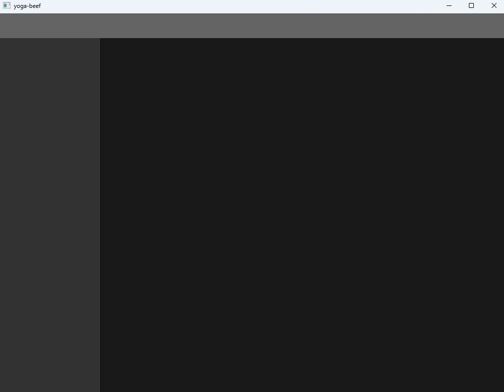

# yoga-beef

This repository contains [Beef language](https://www.beeflang.org/) bindings for the [Yoga layout](https://github.com/facebook/yoga) library.

It is suggested to read the [Yoga documentation](https://www.yogalayout.dev/docs/about-yoga) as an introduction to how to use this project.

# Installation

1. Clone this repo somewhere to your system.
2. In the Beef IDE, right-click workspace panel select "Add Existing Project". Locate the directory you just cloned.
3. For each project that will use `clay-yoga`, right-click > Properties > Dependencies and check `clay-yoga` as a dependency.

# Getting started

There is an [example](./example) in this repo which demonstrates laying out a simple application with a header, a navigation, and a content area. It requires `raylib-beef` to render.

